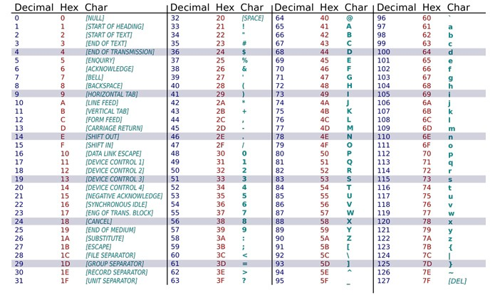

**aprndentação da tabela adcii**

O nome ASCII vem do inglês American Standard Code for Information Interchange ou ”Código Padrão Americano para o Intercâmbio de Informação”. Ele é baseado no alfabeto romano e sua função é padronizar a forma como os computadores representam letras, números, acentos, sinais diversos e alguns códigos de controle.

No ASCII existem apenas 95 caracteres que podem ser impressos, eles são numerados de 32 a 126 sendo os caracteres de 0 a 31 reservados para funções de controle. Ou seja, funções de computador. Alguns caracteres acabaram caindo em desuso pois eram funções específicas para computadores da época como o Teletype (máquinas de escrever eletro-mecânicas), fitas de papel perfurado e impressoras de cilindro.



Voce pode acessar a tabela ACII pelo terminal usando o comando :
```shell
$man ascii
```

[techtudo](https://www.techtudo.com.br/noticias/noticia/2015/02/o-que-e-o-codigo-ascii-e-para-que-serve-descubra.html)